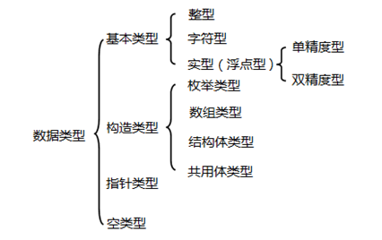
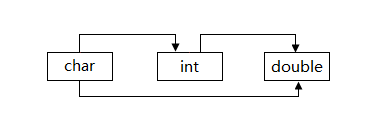

## 基本数据类型

### 什么是数据？

生活中时时刻刻都在跟数据打交道，比如体重数据、血压数据、股价数据等。在我们使用计算机的过程中，会接触到各种各样的数据，有文档数据、图片数据、视频数据，还有聊QQ时产生的文字数据、用迅雷下载的文件数据等。


C语言中，数据类型可分为：**基本数据类型**，**构造数据类型**，**指针类型**，**空类型四大类**。如图所示： 




### 整型、实型和字符型

基本数据类型中最简单也是最常用的整型、实型与字符型。

|  数据类型  |  说明  |  字节  |  应用  |  示例  |
| --- | --- | --- | --- | --- |
|  `char`  |  字符型  |  1  |  用于存储单个字符  |  `char sex = 'M'`  |
|  `int`  |  整型  |  2  |  用于存储整型  |  `int height = 18;`  |
|  `float`  |  单精度浮点数  |  4  |  用于存储小数  |  `float price = 11.1;`  |
|  `double`  |  双精度浮点型  |  8  |  用于存储位数更多的小数  |  `double pi = 3.1415926;`  |


#### 整型

整型数据是指不带小数的数字。生活中有很多信息适合使用整型数据来表示，比如：人的年龄、班级的人数、书的总页数等等。因此整型的类型比较多：

|  数据类型  |  说明  |  字节  |  取值范围  |
| --- | --- | --- | --- |
|  `int`  |  整型  |  2  |  `(-23768~32767) -2^15~2^15-1`  |
|  `short int`  |  短整型（int 可省略）  |  2  |  `(-23768~32767) -2^15~2^15-1`  |
|  `long int`  |  长整形（int 可省略）  |  4  |  `(-2147483648~2147483647) -2^31~2^31-1`  |
|  `unsigned int`  |  无符号整形  |  2  |  `(0~65535) 0~2^16-1`  |
|  `unsigned short int`  |  无符号短整形(int 可省略)  |  2  |  `(0~65535) 0~2^16-1`  |
|  `unsigned long int`  |  无符号长整形(int 可省略)  |  4  |  `(0~4294967295) 0~2^32-1`  |

> `int`、`short int`、`long int`是根据编译环境的不同，所取范围不同。而其中`short int`和`long int`至少是表中所写范围，但是`int`在表中是以16位编译环境写的取值范围。
> 另外 c语言`int`的取值范围在于他占用的字节数 ，不同的编译器，规定是不一样。ANSI标准定义`int`是占2个字节，TC是按ANSI标准的，它的`int`是占2个字节的。但是在VC里，一个`int`是占4个字节的。


#### 浮点数

浮点数据是指带小数的数字。生活中有很多信息适合使用浮点型数据来表示，比如：人的体重(单位：公斤)、商品价格、圆周率等等。因为精度的不同又分为3种：

|  数据类型  |  说明  |  字节  |  取值范围  |
| --- | --- | --- | --- |
|  `float`  |  单精度型  |  4  |  -3.4*10^-38~3.4*10^38  |
|  `double`  |  双精度型  |  8  |  -1.7*10-308~1.7*10^308  |
|  `long double`  |  长双精度型  |  16  |  -1.2*10^-4932~1.7*10^4932  |

>注：C语言中不存在字符串变量，字符串只能存在字符数组中。


## 自动类型转换

数据类型存在自动转换的情况，比如：

```
char a = 'a';
int x;
double d;
x = a; // 字符串类型可以自动转换成整形
d = x; // 整形可以自动转成为浮点型
```

自动转换发生在不同数据类型运算时，在编译的时候自动完成。自动转换遵循的规则就好比小盒子可以放进大盒子里面一样，下图表示了类型自动转换的规则。



char类型数据转换为int类型数据遵循ASCII码中的对应值，ASCII码请查看WIKI。

> 注：字节小的可以向字节大的自动转换，但字节大的不能向字节小的自动转换。


## 强制类型转换

强制类型转换是通过定义类型转换运算来实现的。其一般形式为：

 `(数据类型) (表达式) `

其作用是把表达式的运算结果强制转换成类型说明符所表示的类型，例如：

```
double tempOne = 6.777;
int tempTwo = (int)tempOne; // 强制转换为int类型
printf("%f\n", tempOne); // 6.777000
printf("%d\n", tempTwo); // 6
```


在使用强制转换时应注意以下问题：

1. 数据类型和表达式都必须加括号，如把`(int)(x/2+y)`写成`(int)x/2+y`则成了把x转换成int型之后再除2再与y相加了。

2. 转换后不会改变原数据的类型及变量值，只在本次运算中临时性转换。

3. 强制转换后的运算结果不遵循四舍五入原则。


