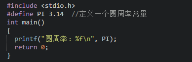

## 常量


在程序执行过程中，值不发生改变的量称为常量。C语言的常量可以分为直接常量和符号常量。

直接常量也称为字面量，是可以直接拿来使用，无需说明的量，比如：

*   整型常量：13、0、-13；
*   实型常量：13.33、-24.4；
*   字符常量：‘a’、‘M’
*   字符串常量：”I love imooc!”

下面的代码分别打印这四种直接常量：

```
printf("%d\n", 100);
printf("%f\n", 3.1415);
printf("%c\n", 'a');
printf("I love You");
```

在C语言中，可以用一个标识符来表示一个常量，称之为符号常量。符号常量在使用之前必须先定义，其一般形式为：

```
#define 标识符 常量值 
```

符号常量的标示符一般习惯使用大写字母，变量的标示符一般习惯使用小写字母，加以区分。

下面是一个使用符号常量的小例子：


```
#include <stdio.h>
#define PI 3.14 // 定义一个圆周率常量
int main() {
	printf("圆周率：%f\n", PI);
	return 0;
}
```

运算结果为： `圆周率：3.140000`

> 注意：常量是不可改变的

## 常量分类
- 整型常量,也就是整常数。
    + 二进制
    + 十进制
    + 八进制
    + 十六进制

- 实型常量。
    + 单精度
    + 双精度

- 字符型常量。
    + 普通字符
    + 转义字符

- 字符串常量。
    + 将一个或者多个字符用双引号（""）括起来，这样构成的就是字符串常量。
    + 注意字符串常量和字符型常量是不一样的。

## 不同类型常量的表示方法

### 整型常量
- 整型常量可以用三种样子:
    + 十进制整数。如356,-120,0。
    + 八进制整数。八进制形式的常量都以0开头,如0123,也就是十进制的83;-011,也就是十进 制的-9。
    + 十六进制整数。十六进制的常量都是以0x开头,如0x123,就是十进制的291。
    + 二进制整数。逢二进一 0b开头


### 实型常量
- 实型常量又分两种:
    + 单精度小数:以f结尾，如：0.5f;
    + 双精度小数:十进制小数形式。这个我们应该很熟悉了,小学就学了的,不过注意:0.0也是实型 常量。


```
实型的另一种表示形式:
    + 指数形式。上过初中的都应该知道科学计数法吧,指数形式的常量就是科学计数法的另一种表 示,比如123000,用科学计数法表示为1.23×10的5次方,用C语言表示就是1.23e5或1.23E5,注意e或E的前面必须要有数字,而且e或E后面的数字一定要是整数。
```

### 字符型常量

- 字符型常量都是用''(单引号)括起来的,其表现形式可以有两种:
    + 一般形式。一个字符用''括起来,注意只能有一个字符。
    + 特殊形式。特殊形式都是以\开头,它们在屏幕上不会直接显示出来,而是根据其特定的功能来 显示的,这些特殊字符常量有:
```
\n 换行,相当于敲一下回车。
\t 跳到下一个tab位置,相当于按一下键盘上的tab键。 \b 退格,相当于按一下backspace。
\r 回车。
\f 换页,光标移到到下页开头。
\\ 输出\字符,也就是在屏幕上显示一个\字符。
\' 输出'字符,也就是在屏幕上显示一个'字符。
\" 输出"字符,也就是在屏幕上显示一个"字符。
\ddd 1位到3位八进制数表示的字符。
例如:使用'\376',则在屏幕上显示一个黑色的方块。 \xhh 1位到2位十六进制数表示的字符。注意x不能丢了
```

### 字符串常量

- 字符串常量与字符常量不同的地方是,字符串常量是用""把字符串括起来,所以'a'和"a"是不一 样的,而且系统会在字符串常量的末尾自动加一个字符串结束标志('\0')。


### 自定义常量
- 格式: const 数据类型 常量名称 = 值
    + 例如: const int NUM = 998;